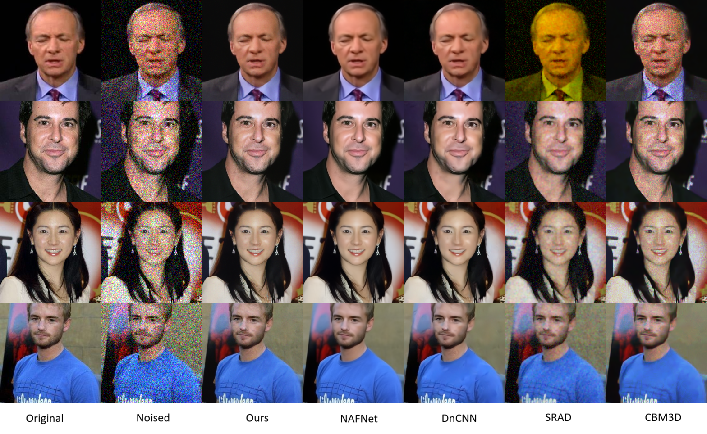
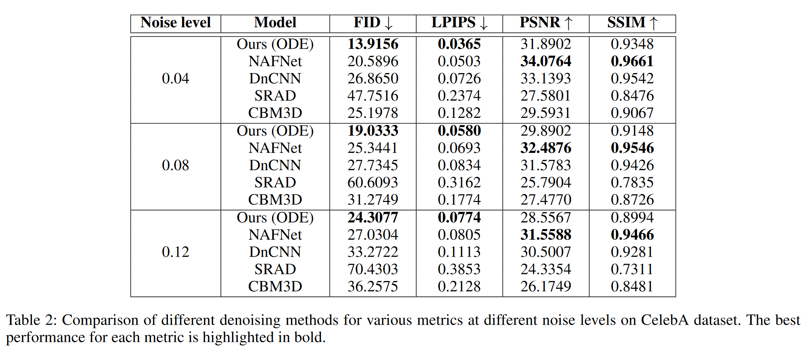

# SDE-based Multiplicative Noise Removal

This is the code accompanying the paper **SDE-based Multiplicative Noise Removal** https://arxiv.org/abs/2408.10283



Consider citing us if this work helps your research:
```
@misc{vuong2024sdebasedmultiplicativenoiseremoval,
      title={SDE-based Multiplicative Noise Removal}, 
      author={An Vuong and Thinh Nguyen},
      year={2024},
      eprint={2408.10283},
      archivePrefix={arXiv},
      primaryClass={eess.IV},
      url={https://arxiv.org/abs/2408.10283}, 
}
```

## Python environment
Please refer to `requirements.txt`

## Training
### To train the SDE model 
```bash
python train_denoise_sde.py --img-size 224 --batch-size 32 --img-dir ./datasets/img_celeba --img-data-amount large --device cuda:0 --cpu-workers 5 --exp-name noise-removal-celeba-large-RGB-224-500 --epochs 100 --save-every 1 --unet-channels 128 --unet-in-ch 3 --unet-out-ch 3 --unet-num-res 2 --ddpm-num-steps 500 --lr 1e-6 
```
### To train the NAFNet model
Clone the repository https://github.com/megvii-research/NAFNet. Before building the wheel, several files need to be patched to use the latest torch version, these files are provided in `nafnet_configs`
- `requirements.txt`
- `basicsr/models/image_restoration_model.py`

Training config files are provided in `nafnet_configs/train`. Then the following command is used to train
```bash
python basicsr/train.py -opt nafnet_configs/train/NAFNet-width64-celeba-t100.yml
```
### To train the DnCNN model
Clone the repository https://github.com/cszn/KAIR. Then patch the following files, provided in `dncnn_configs/files`
- `data/dataset_dncnn.py`
- `main_test_dncnn.py`
- `main_train_dncnn.py`
- `utils/utils_image.py`
Training config files are provided in `dncnn_configs/train`. Then the following command is used to train
```bash
python main_train_dncnn.py --opt options/train_dncnn_celeba_t100.json 
```
## Testing
### To generate test dataset
```bash
generate_test_data.py --img-size 224 --batch-size 16 --dataset celeba --img-dir ./datasets/img_celeba --ddpm-num-steps 500 --ddpm-target-steps 150 --img-data-amount test --img-out ./datasets/celeba_prepared/img_celeba_test_t150
```
### To denoise using SDE
#### Stochastic
```bash
python denoise_sde.py --img-size 224 --batch-size 8 --dataset landuse --img-dir ./datasets/landuse_prepared/img_landuse_all_t100 --ddpm-num-steps 500 --ddpm-target-steps 100  --img-out ./test_images/landuse_all/denoised_images_landuse --model-path ./models/sde_model.pkl

```
#### Deterministic ODE
```bash
python denoise_sde.py --img-size 224 --batch-size 8 --dataset landuse --img-dir ./datasets/landuse_prepared/img_landuse_all_t100 --ddpm-num-steps 500 --ddpm-target-steps 100  --img-out ./test_images/landuse_all/denoised_images_landuse --model-path ./models/sde_model.pkl --deterministic
```
#### Deterministic DDIM
```bash
python denoise_sde.py --img-size 224 --batch-size 8 --dataset landuse --img-dir ./datasets/landuse_prepared/img_landuse_all_t100 --ddpm-num-steps 500 --ddpm-target-steps 100  --img-out ./test_images/landuse_all/denoised_images_landuse --model-path ./models/sde_model.pkl --deterministic --ddim
```
### To denoise using NAFNet
Clone the repository https://github.com/megvii-research/NAFNet. Then use the configuration files provided in `nafnet_configs/test`, using the following command
```bash
python basicsr/test.py -opt nafnet_configs/test/NAFNet-width64-finetuned-celeba-landuse-t100.yml
``` 

### To denoise using DnCNN
Clone the repository https://github.com/cszn/KAIR. Then perform denoising using the following command
```bash
python main_test_dncnn.py --model_path model_zoo/dncnn_celeba_t100.pth --testsets ./datasets/landuse_prepared --testset_name img_landuse_all_t300 --cleanset_name img_landuse_all_clean --results ./denoised_images_landuse_dncnn --model_name dncnn_celeba_t100
```

### To denoise using SRAD
```bash
python denoise_srad.py --img-dir ./datasets/celeba_prepared/img_celeba_test_t100 --img-out ./test_images/celeba/denoised_images_celeba --ddpm-target-steps 100
```

### To denoise using BM3D
```bash
python denoise_bm3d.py --img-dir ./datasets/celeba_prepared/img_celeba_test_t100 --img-out ./test_images/celeba/denoised_images_celeba --ddpm-target-steps 100
```

## Metrics calculation
- FID is calculated using https://github.com/mseitzer/pytorch-fid
```bash
python -m pytorch_fid --device cuda:0 ./datasets/landuse_prepared/img_landuse_all_clean ./datasets/denoised_images_landuse_dncnn/img_landuse_all_t100
```
- LPIPS is calculated using https://github.com/richzhang/PerceptualSimilarity
```python
import lpips
loss_fn_alex = lpips.LPIPS(net='alex')
lpips = loss_fn_alex(img_clean_torch, img_denoised_torch)
```
- PSNR and SSIM are calculated using the metrics module from NAFNet, which can be imported and used by
```python
import importlib
import sys
sys.path.append("./codes/NAFNet")
metric_module = importlib.import_module('basicsr.metrics')

psnr = metric_module.calculate_psnr(img_clean, img_denoised, False)
ssim = metric_module.calculate_ssim(img_clean, img_denoised, False)
```


## Note on dataset
CelebA dataset is obtained at https://mmlab.ie.cuhk.edu.hk/projects/CelebA.html. Images numbered from 0-99,999 are used for training. Images numbered from 100,000-102,095 are used for testing.

UC Merced Land Use dataset is obtained at http://weegee.vision.ucmerced.edu/datasets/landuse.html. All images are used for testing.